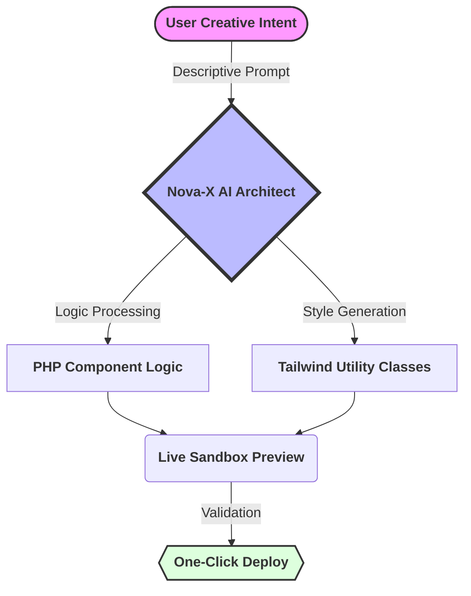

# 
🚀 Nova-X | AI Theme Architect

  
  
  

---

## 💎 The Vision
**Nova-X** is a revolutionary AI-driven ecosystem designed for modern WordPress architects. It transforms human creative intent into production-ready block themes by bridging the gap between natural language prompts and technical Tailwind CSS execution.

> [!IMPORTANT]
> **Nova-X** is currently in active development. It is built to empower developers to build faster, style smarter, and architect better.

---

## 🛠️ Integrated Architecture
The Nova-X engine operates on a three-tier "Smart Logic" framework to ensure code quality and design consistency.

### **The Intelligence Workflow**

---

## 🤖 Supported AI Providers

Nova-X supports multiple AI providers, giving you flexibility to choose the best AI model for your needs:

| Provider | Models | Status |
|----------|--------|--------|
| **OpenAI** | GPT-4, GPT-4 Turbo, GPT-3.5 | ✅ Supported |
| **Google Gemini** | Gemini Pro, Gemini Ultra | 🚧 Coming Soon |
| **Anthropic Claude** | Claude 3 Opus, Claude 3 Sonnet, Claude 3 Haiku | 🚧 Coming Soon |
| **Mistral AI** | Mistral Large, Mistral Medium | 🚧 Coming Soon |
| **Cohere** | Command, Command Light | 🚧 Coming Soon |

### Provider Features

- **Multiple Provider Support**: Switch between providers based on your needs
- **User-Managed API Keys**: Store and manage API keys securely in WordPress options
- **Provider Fallback**: Automatic failover to backup providers (coming soon)
- **Usage Tracking**: Monitor API usage per provider (coming soon)

For detailed information on managing API keys, see [API Key Manager Documentation](docs/07-settings-page-api-key-manager.md).

---

## ✨ Core Features

| Feature | Visual Status | Description |
|---------|---------------|-------------|
| Architect Chat | ⚡ | Interactive sidebar for real-time AI theme building. |
| Tailwind Engine | 🎨 | Automatic CSS generation with zero manual configuration. |
| Live Sandbox | 🖥️ | Preview changes in a secure iframe without breaking your site. |
| Smart Export | 📦 | Package your AI-generated theme for live production use. |
🚀 Rapid Installation
Setting up your professional development environment takes less than 2 minutes.

1. Clone & Prepare
git clone [https://github.com/OGC-NewFinity/Nova-X.git](https://github.com/OGC-NewFinity/Nova-X.git)
2. Environment Configuration
Navigate to your nova-x.php file and define your secure entry point:

PHP

define('NOVA_X_API_KEY', 'sk-your-secure-openai-key-here');
📅 Roadmap: The Path to v1.0
Nova-X follows a strict development sprint cycle to ensure feature stability.

Phase 1: Foundation ✅

Infrastructure setup & Localhost synchronization.

Phase 2: Orchestration 🔄 (Current)

Refining AI Prompt Context & Tailwind logic.

Phase 3: Visual Dashboard ⏳

React-based Pro UI with real-time component controls.

Phase 4: Marketplace Ready ⏳

Automated theme packaging and export modules.

 <b>Built with passion by <a href="https://ogcnewfinity.com">OGC NewFinity</a></b>

